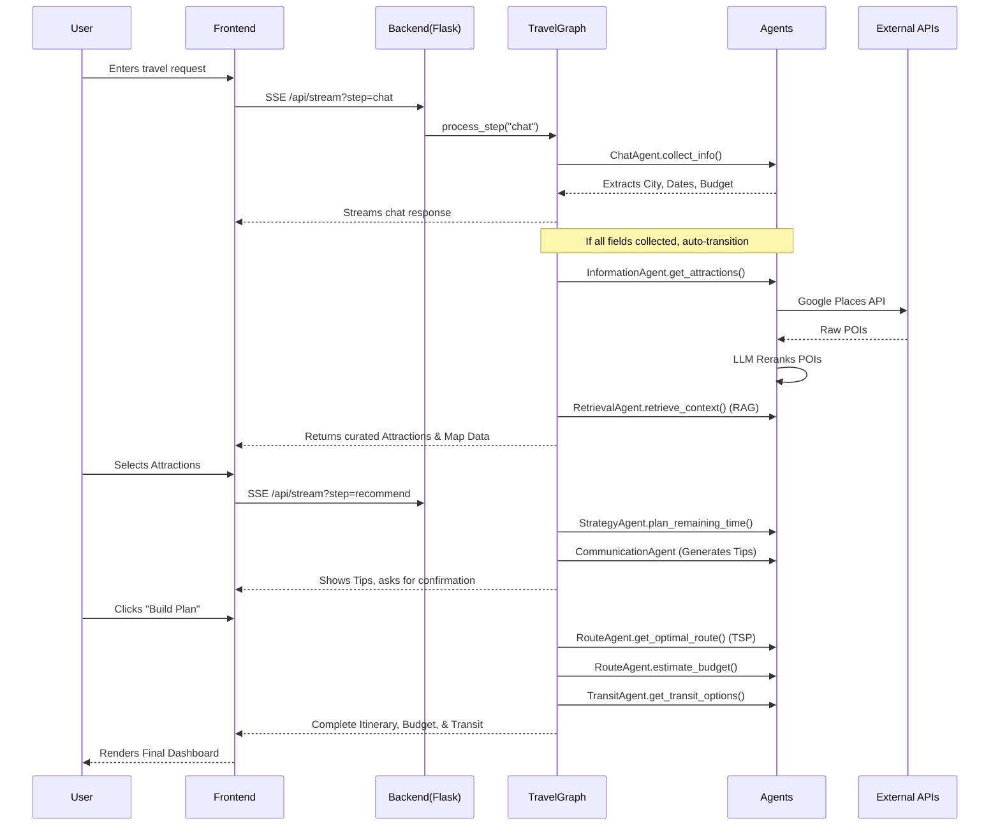

# Technical Documentation for ExploreX – Intelligent Collaborative Agents for Dynamic Personalized Travel Planning

## 1. Project Overview

### Purpose of the Project
ExploreX (formerly Vaiage) is a highly interactive, intelligent travel planning application designed to generate personalized travel itineraries within India. It replaces manual, tedious trip-planning with an AI-driven, multi-agent conversational interface.

### Problem Statement
Traditional travel booking platforms require users to visit multiple websites to search for destinations, accommodations, transportation, and daily itineraries. Furthermore, generic itineraries often fail to account for a user’s specific constraints such as budget, health limitations, traveling with children, and niche hobbies.

### Motivation
The motivation behind ExploreX is to provide a seamless, end-to-end trip planning experience using advanced Large Language Models (LLMs). By utilizing specialized AI agents, the system can extract user intent, retrieve factual geographical data, evaluate budget constraints, and formulate optimal routes.

### Objectives
- Automate itinerary generation based on conversational user input.
- Validate locations strictly within India.
- Provide optimized, mapped routes connecting points of interest.
- Formulate realistic budget estimates (accommodations, food, local/intercity transit, car rentals).
- Offer contextual background knowledge via a Retrieval-Augmented Generation (RAG) pipeline.

### Key Features
- **Multi-Agent Orchestration**: Specialized agents for chatting, retrieving information, routing, and communication.
- **Dynamic Cost Optimization**: Iterative budget reduction to meet strict numeric constraints.
- **Intelligent Routing**: Waypoint optimization using Google Maps API.
- **RAG-Powered Context**: Uses a vector database (ChromaDB) for localized travel knowledge.

### Technologies Used
- **Backend**: Python, Flask, Flask-Session
- **Frontend**: HTML5, CSS3, JavaScript (Vanilla), Leaflet.js (Mapping)
- **AI/LLMs**: Google Gemini (gemini-flash-lite-latest), LangChain
- **Databases/Vector Stores**: ChromaDB, HuggingFace Embeddings
- **External APIs**: Google Maps (Geocoding, Places, Directions), Weather API, RapidAPI (Car Rentals)

---

## 2. Overall Architecture

ExploreX operates on a modular, state-driven architecture where a central Workflow Manager orchestrates a pipeline of specialized AI agents.

- **Frontend**: A single-page application (SPA) handling user chat, displaying dynamic maps, listing attractions, and rendering the final itinerary and budget. Uses Server-Sent Events (SSE) to stream AI responses.
- **Backend (Flask)**: Manages API routing, user session state, and triggers the `TravelGraph` workflow.
- **AI Layer (Multi-Agent System)**: A collection of specialized Python classes (Agents) utilizing LangChain and Google Gemini to process specific segments of the travel planning logic.
- **RAG Pipeline**: `RetrievalAgent` queries ChromaDB to provide real-world context (e.g., local customs, accessibility) to the planning agents.
- **External Services Layer**: Interfaces with Google Maps (for routing and POIs), weather services, and rental car APIs to inject deterministic, real-time data into the LLM context.

### Communication Flow
1. The Frontend sends user input to the Backend.
2. The Backend retrieves the user's `TravelGraph` instance via Flask-Session.
3. The Graph delegates tasks sequentially to the Agents.
4. Agents utilize External Services and the RAG Pipeline to build the state.
5. The Backend streams the state updates and AI responses back to the Frontend.

---

## 3. Complete Project Folder Structure

### Root Directory: `d:\project\explorex_main_india\`

#### `main.py`
- **Purpose**: The core Flask backend server.
- **What it does**: Initializes Flask, configures filesystem-based sessions, and exposes API endpoints (`/api/process`, `/api/stream`, `/api/reset`). It manages the instantiation of the `TravelGraph` for each user session.
- **Why it is needed**: It is the entry point connecting the web frontend to the Python backend.

#### `workflows/travel_graph.py`
- **Purpose**: State machine and orchestrator.
- **What it does**: Defines the `TravelGraph` class which maintains a central `state` dictionary (user_info, budget, itinerary, etc.). It transitions the user through different stages (`chat` -> `information` -> `retrieval` -> `recommend` -> `strategy` -> `communication` -> `route`).
- **Why it is needed**: Ensures that agents are called in the correct logical order and share a unified data state.

#### `agents/` Folder
- **Purpose**: Contains all the specialized AI agent modules.
- **Files**:
  - `chat_agent.py`: Converses with the user, extracting mandatory fields (city, dates, budget).
  - `information_agent.py`: Interacts with Google Maps/Places. Fetches POIs and uses LLMs to rerank them based on user hobbies.
  - `retrieval_agent.py`: The RAG implementation using ChromaDB.
  - `recommend_agent.py`: Filters attractions based on hard constraints (budget, kids, health).
  - `strategy_agent.py`: Analyzes selected attractions and plans how to distribute them across the given days (creates a daily plan outline). Also decides if car rentals are needed.
  - `route_agent.py`: Executes the TSP (Traveling Salesman Problem) algorithm and calls Google Directions to calculate optimal route paths. Generates the final budget.
  - `communication_agent.py`: Generates the final conversational summary, travel tips, and mock email confirmations.
  - `transit_agent.py`: Generates inter-city travel options (Flights, Trains, Buses).

#### `services/` Folder
- **Purpose**: Wrappers for external APIs.
- **Files**: `maps_api.py`, `weather_api.py`, `car_rental_api.py`, `fuel_price_api.py`.
- **Why it exists**: Abstracts raw HTTP requests and API key management away from the agent logic.

#### `frontend/` Folder
- **Purpose**: The web interface.
- **Subfolders**:
  - `static/js/main.js`: Handles DOM manipulation, EventSource (SSE) streaming, and Leaflet map rendering.
  - `static/css/style.css`: UI styling.
  - `templates/index.html`: The main markup structure.

#### `data/` Folder
- **Purpose**: Stores static JSON databases, ChromaDB vector files, and caches.
- **Files**: `attractions.json`, `car_rental_cache.json`, `vector_db/`.

---

## 4. Complete End-to-End Pipeline

1. **Initialization**: User opens ExploreX. `main.py` serves `index.html` and creates a fresh Flask session and an empty `TravelGraph`.
2. **Information Gathering (Chat Phase)**: 
   - The user chats with the AI.
   - `chat_agent.py` uses structured output to extract `origin_city`, `city`, `days`, `budget`, `people`, `kids`, `health`, `hobbies`, `start_date`.
   - The loop continues until all mandatory fields are extracted.
3. **Information & Validation Phase**:
   - `information_agent.py` validates if the destination is within India using Google Geocoding.
   - It fetches weather data and top attractions via Google Places API.
   - The LLM reranks attractions based on user hobbies.
4. **Context Retrieval (RAG)**:
   - `retrieval_agent.py` queries ChromaDB for contextual background on the city (e.g., local customs, accessibility).
5. **Recommendation & Selection**:
   - The frontend displays the curated list of attractions.
   - The user selects their favorite spots.
6. **Strategy & Planning**:
   - `strategy_agent.py` drafts a high-level daily plan (e.g., Day 1: Forts, Day 2: Markets).
   - It determines if a rental car is recommended.
7. **Communication (Pre-Itinerary Summary)**:
   - `transit_agent.py` generates intercity travel options.
   - `route_agent.py` runs a preliminary budget estimate.
   - `communication_agent.py` streams travel tips and summaries to the user, asking for final confirmation.
8. **Routing & Final Itinerary**:
   - Upon confirmation, `route_agent.py` applies a TSP approximation to order the attractions optimally by distance.
   - A detailed day-by-day itinerary with estimated timings is generated.
   - The final budget is locked in.
9. **Final Output**: The frontend renders the map, the itinerary timeline, the budget breakdown, and transit tabs.

---

## 5. Agent-by-Agent Explanation

### 1. Chat Agent (`chat_agent.py`)
- **Purpose**: Conversational data collection.
- **Inputs**: Raw user text.
- **Processing**: Uses LangChain's `with_structured_output(TravelState)` to parse out Pydantic fields.
- **Output**: Returns a dictionary of extracted entities and a list of still-missing fields.

### 2. Information Agent (`information_agent.py`)
- **Purpose**: Bridges the LLM with real-world geospatial data.
- **Inputs**: User preferences, city name.
- **Processing**: Calls Google Maps API to find points of interest. It enforces an India-only bounding-box validation. It constructs a prompt asking Gemini to rerank these POIs based on the user's hobbies.
- **Output**: An array of enriched, LLM-ranked attraction objects (including photos, ratings, and locations).

### 3. Retrieval Agent (`retrieval_agent.py`)
- **Purpose**: Injects localized knowledge (RAG).
- **Inputs**: User preferences (health, hobbies) and destination city.
- **Processing**: Converts the query into embeddings and performs a similarity search in ChromaDB.
- **Output**: Contextual text strings (e.g., "The Red Fort has limited wheelchair access at the eastern gate").

### 4. Recommend Agent (`recommend_agent.py`)
- **Purpose**: Hard-filtering of attractions.
- **Processing**: Filters out attractions if they exceed the user's budget level, or if they are unsuitable for children/health constraints.

### 5. Strategy Agent (`strategy_agent.py`)
- **Purpose**: High-level chronological planning and logistics.
- **Inputs**: Selected attractions, total days, weather, RAG context.
- **Processing**: Prompts the LLM to group attractions logically into `day1`, `day2`, etc., ensuring geographical sense and balancing durations. Also uses regex to extract a `[car_rental:YES/NO]` decision.
- **Output**: A dictionary mapping days to lists of attraction names, and a boolean for car rental.

### 6. Route Agent (`route_agent.py`)
- **Purpose**: Solves the routing mathematics and finalizes the budget.
- **Algorithms**: Uses Google Maps Waypoint Optimization. If unavailable, falls back to an internal Traveling Salesman Problem (TSP) solver using the Haversine formula and NetworkX approximation.
- **Budgeting**: Computes exact dynamic costs, adjusting iteratively if the user provided a "strict" numerical budget (e.g., scaling down food/transport multipliers until it fits).

### 7. Communication Agent (`communication_agent.py`)
- **Purpose**: User engagement and summaries.
- **Processing**: Drafts the Markdown summaries, localized tips, and simulated email confirmations.

### 8. Transit Agent (`transit_agent.py`)
- **Purpose**: Inter-city logistics.
- **Processing**: Prompts the LLM to generate realistic, JSON-formatted mock schedules for Flights, Trains, and Buses based on the origin and destination.

---

## 6. RAG Pipeline

**Workflow in `retrieval_agent.py`:**
1. **Document Loading & Vector Store**: Travel knowledge is pre-embedded and stored locally in `data/vector_db` using **ChromaDB**.
2. **Embeddings**: Utilizes HuggingFace Embeddings (`all-MiniLM-L6-v2`) to convert text into dense vectors.
3. **Context Retrieval**: When a user queries a city, the agent constructs a search string incorporating their hobbies, budget, and health status.
4. **Similarity Search**: Performs a K-Nearest Neighbors (k=3) similarity search against the vector database.
5. **Prompt Construction**: The retrieved documents are appended to the system prompts of the Strategy and Recommend agents to ensure the generated itineraries respect local realities.

---

## 7. Algorithms Used

- **Entity Extraction (Pydantic / Structured LLM)**: Instead of regex, `chat_agent.py` relies on the LLM's native JSON structuring capabilities to parse complex intents (e.g., distinguishing "I have 50000 rupees" from "I want a cheap trip").
- **LLM Reranking**: `information_agent.py` passes 30-40 generic Google Places results to the LLM, asking it to sort them into `interest_based` and `popular_fallback` buckets based on semantic matching with user hobbies.
- **Traveling Salesman Problem (TSP) Approximation**: 
  - *Primary*: Google Maps API `optimize_waypoints=True`.
  - *Fallback*: `route_agent.py` builds a distance matrix using the **Haversine formula**. It then uses the `networkx.approximation.traveling_salesman_problem` algorithm to find a near-optimal sequential route.
- **Iterative Cost Reduction**: If a strict numeric budget is set, `route_agent.py` enters a `while` loop (up to 4 iterations), multiplying daily cost parameters (food, accommodation) by a decay factor (e.g., 0.85) until the calculated total drops below the user's maximum budget.

---

## 8. API Flow

### Frontend to Backend Endpoints (`main.py`)
1. **`GET /`**: Initializes a new session ID and serves `index.html`.
2. **`POST /api/process`**: 
   - **Inputs**: JSON payload containing `step` (e.g., "strategy"), `session_id`, `user_input`.
   - **Processing**: Advances the `TravelGraph` state machine. Does not support streaming.
   - **Outputs**: JSON containing the updated global state.
3. **`GET /api/stream`**:
   - **Inputs**: URL parameters (`step`, `session_id`, `user_input`).
   - **Processing**: Triggers LLM generation. Yields Server-Sent Events (SSE) `data: {"type": "chunk", "content": "..."}` for typing animations in the UI. 
   - **Outputs**: Ends with a final `{"type": "complete", "next_step": "...", "state": {...}}` JSON payload.
4. **`POST /api/reset`**: Clears Flask filesystem sessions.

---

## 9. Data Flow

1. **User** types a message in the UI.
2. **Frontend** sends a request to `/api/stream?step=chat`.
3. **Backend** passes the message to `TravelGraph.process_step()`.
4. **Agent** (`ChatAgent`) reads `state["user_info"]`, updates it with new entities, and streams text back.
5. Once all fields are collected, `TravelGraph` auto-transitions to `information`.
6. **External APIs** (Google Maps) are queried. Results are saved to `state["attractions"]`.
7. **Frontend** receives the complete payload and renders the attraction selection UI.
8. The user selects attractions, posting back to `/api/stream?step=recommend`.
9. The data flows sequentially through Strategy -> Communication -> Route.
10. **Final UI** renders the `state["itinerary"]` and `state["budget"]`.

---

## 10. Frontend Workflow

The frontend is built with vanilla HTML/JS/CSS to remain lightweight.
- **Chat Interface**: Uses SSE (`EventSource`) to capture streaming text chunks and render them in a chat window, providing a ChatGPT-like typing experience.
- **Recommendation Page**: Once attractions are loaded, the DOM switches to a grid view where users can click cards to select POIs. Leaflet.js renders markers on a map simultaneously.
- **Communication Step**: Renders the AI's travel tips and asks for a final "Build Plan" confirmation.
- **Final Itinerary & Budget**: 
  - **Itinerary**: Renders an accordion/timeline of days and times.
  - **Budget**: Renders a Chart.js pie chart mapping costs (Accommodation, Food, Transport).
  - **Transit**: Renders tabs (Flights, Trains, Buses) parsed from the Transit Agent's JSON.

---

## 11. Backend Workflow

- **Flask Setup**: Uses `Flask-Session` backed by the filesystem to ensure state persists across multiple asynchronous SSE requests.
- **State Management**: `TravelGraph` holds a master `self.state` dictionary. Every agent reads from this dictionary, performs its work, and mutates it.
- **Workflow Transitions**: Managed by a backend `while True` loop inside `/api/stream`. If an agent finishes its work silently (without needing user input, like `retrieval`), the backend intercepts the `next_step` and loops to the next agent automatically before closing the HTTP connection.

---

## 12. External APIs

| API | Purpose | Inputs | Outputs |
|-----|---------|--------|---------|
| **Google Maps Geocoding** | Validate Indian cities | City Name string | Lat/Lng coordinates, Country Code |
| **Google Places** | Fetch POIs and hotels | Lat/Lng, radius, keyword | JSON list of places, ratings, photos |
| **Google Directions** | TSP Routing | Origin, Dest, Waypoints | Distance, Duration, Polyline |
| **RapidAPI Car Rentals** | Estimate rental costs | Location, Dates, Age | List of available cars and prices |
| **OpenWeatherMap** (assumed) | Fetch forecasts | Lat/Lng, Dates | Weather summary strings |

---

## 13. Libraries Used

- **Flask & Flask-Session**: Core web framework and persistent session tracking.
- **LangChain & langchain-google-genai**: Framework for abstracting LLM calls, managing prompts, streaming, and Pydantic structured extraction.
- **Google Generative AI (Gemini)**: The core intelligence engine. Chosen for speed (`flash-lite`) and high context window.
- **Chroma**: Local vector database for RAG.
- **HuggingFaceEmbeddings**: Generates vector representations of text for ChromaDB.
- **Googlemaps**: Official Python client for Maps APIs.
- **NetworkX**: Used as a fallback for complex TSP graph math if Google Directions optimization fails.

---

## 14. Sequence Diagram

---

## 15. Complete Execution Example

**User Input:** "I want to explore Rajasthan for 5 days with ₹50,000."

1. **Chat Agent**: Extracts `city: "Rajasthan"`, `days: 5`, `budget_amount: 50000`. Still needs `origin_city`, `people`, etc. Prompts user.
2. **User Input**: "I am starting from Delhi, it's just me, no kids, good health, I like history."
3. **Information Agent**: Detects "Rajasthan" is an entire state via `INDIA_STATES_MAP`. Selects major cities (Jaipur, Udaipur, Jodhpur). Queries Google Places for top historical spots (Forts, Palaces). LLM reranks them prioritizing historical sites.
4. **Retrieval Agent (RAG)**: Queries ChromaDB for "Rajasthan history travel guides 50000 budget".
5. **UI**: Displays Amber Fort, City Palace, Mehrangarh Fort. User selects them.
6. **Strategy Agent**: Allocates Jaipur to Days 1-2, Jodhpur to Days 3-4. Determines `[car_rental:NO]` because trains between these cities are highly efficient.
7. **Transit Agent**: Generates mock train options (e.g., Delhi to Jaipur Shatabdi Express) and flights.
8. **Communication Agent**: Streams: "Rajasthan is beautiful! Pack light cotton clothes. Are you ready for the itinerary?"
9. **Route Agent**: Runs TSP logic. Calculates costs. Checks total against the strict ₹50,000 budget. If total is ₹55,000, it iteratively scales down food/transport estimates by 15% until the plan fits within ₹50,000.
10. **Final UI**: Displays the chronological itinerary, the dynamic budget chart showing the exact breakdown, and the recommended train tickets from Delhi.

---

## 16. Source Code References

- **State Management**: `workflows/travel_graph.py` -> `TravelGraph.process_step()`. This is the central router of the application.
- **LLM Structured Extraction**: `agents/chat_agent.py` -> `TravelState` Pydantic model and `structured_extractor.invoke()`.
- **RAG Implementation**: `agents/retrieval_agent.py` -> `retrieve_context()` uses Chroma similarity search.
- **TSP Routing**: `agents/route_agent.py` -> `_solve_tsp_approximate()` utilizes `networkx`.
- **Budget Iteration**: `agents/route_agent.py` -> `estimate_budget()` contains the `while` loop enforcing strict numerical limits.
- **Geographic Fencing**: `agents/information_agent.py` -> `validate_indian_location()` enforces the India-only constraint using Google Geocoding address components.

---

## 17. Code Quality Review

### Strengths & Good Design Decisions
- **Agent Decoupling**: Breaking the monolith into specialized agents (`RouteAgent`, `TransitAgent`, etc.) makes prompts highly focused and significantly reduces LLM hallucinations.
- **Graceful Degradation**: If Google Maps waypoint optimization fails, the system falls back to a custom NetworkX TSP solver (`route_agent.py`). If the Car Rental API fails, it mocks the data instead of crashing.
- **Strict Typing for Intents**: Replacing regex with Langchain's Pydantic structured output for the `ChatAgent` drastically improved intent recognition.

### Potential Improvements & Scalability
- **State Persistence**: Currently, Flask-Session relies on the local filesystem. For production scalability (Kubernetes/Load Balancers), this must be migrated to Redis.
- **LLM Latency**: Performing LLM reranking of 40 POIs can be slow. Upgrading to a specialized, lightweight reranker model (like Cohere) rather than a general generative LLM would decrease latency.
- **Token Limits**: The `TravelGraph` state grows continuously. Eventually, passing the entire history to the Communication Agent could exceed context windows. Implementing a rolling memory summarize function is recommended.

---

## 18. Appendix: Error Log & Root Cause Analysis

*(Consolidated from ExploreX development logs)*

### Tier 1: Basic Errors (Simple code, syntax, and configuration bugs)

**1. Windows Console UnicodeEncodeError**
- **Error:** The backend Python app crashed while printing LLM output to the console.
- **Root Cause:** Windows CMD defaults to `cp1252` encoding, which cannot handle non-ASCII characters (emojis).
- **Fix:** Reconfigured console standard output encoding to UTF-8 globally in `main.py`.

**2. Missing Currency Formatter Function (`inr()`)**
- **Error:** The Budget Estimate and Itinerary sections failed to render, throwing a `ReferenceError`.
- **Root Cause:** The frontend called a currency formatter function `inr()` that was never defined. A flawed null-check also failed on a valid value of `0`.
- **Fix:** Defined `inr()` using `Intl.NumberFormat('en-IN')` and hardened the null-checking logic.

**3. Legacy Branding in Email Output**
- **Error:** Email confirmations were signed off as "Warmly, Vaiage" instead of "ExploreX".
- **Root Cause:** The system prompt in `communication_agent.py` contained old project branding.
- **Fix:** Updated the `SystemMessage` branding strictly to "ExploreX".

**4. Missing Budget Dictionary Keys**
- **Error:** The frontend budget chart displayed "undefined level for undefined room(s)".
- **Root Cause:** The `estimate_budget` function inside `BudgetAgent` returned a dictionary missing the `budget_level` and `rooms` keys.
- **Fix:** Updated the backend logic to return the required keys dynamically.

**5. Hardcoded Attraction List Truncation**
- **Error:** Valid attractions were limited to the Top 20, even when 50+ relevant points were found.
- **Root Cause:** Hardcoded Python list slicing (`[:20]`) in the agent's response logic.
- **Fix:** Removed explicit truncation limits, preserving the LLM's full relevancy ranking.

**6. Third-Party API Timeouts / Missing Keys**
- **Error:** The entire workflow crashed due to missing API keys for Maps and transit APIs.
- **Root Cause:** Unhandled exceptions when API requests returned `401 Unauthorized`.
- **Fix:** Created mock data fallbacks and `try-except` blocks to allow development to continue.

---

### Tier 2: Intermediate Errors (Parsing, data-structure, and validation bugs)

**7. Date Parsing Failure (500 Internal Server Error)**
- **Error:** The Route Agent caused a 500 Error when calculating itineraries.
- **Root Cause:** `datetime.strptime` strictly expected `YYYY-MM-DD`, but conversational dates ("next week") were passed as strings.
- **Fix:** Implemented runtime type-checking and conversion to cast string dates into native `datetime` objects.

**8. Same Date Assigned to Every Itinerary Day**
- **Error:** The itinerary displayed the same date for every day.
- **Root Cause:** The Route Agent reused the `start_date` string without incrementing it.
- **Fix:** Implemented strict `datetime` arithmetic (`start_date + timedelta(days=i)`).

**9. Infinite Loop on "Flexible" Dates**
- **Error:** The system repeatedly asked for a start date even after the user replied "Not decided".
- **Root Cause:** The validation pipeline required a date-formatted string.
- **Fix:** Updated the validator to accept "flexible" and fallback to the current timestamp during generation.

**10. Invalid JSON from `NaN` Values (Infinite Reconnect Loop)**
- **Error:** After generating recommendations, the UI froze; the network tab showed `/api/stream` continuously reconnecting.
- **Root Cause:** Google Places API returned missing values, interpreted as `float('nan')`. JavaScript's `JSON.parse()` threw a `SyntaxError` on `NaN`, preventing the event source from closing cleanly.
- **Fix:** Implemented a recursive `scrub_floats()` utility to sanitize payloads, converting `NaN` to `null`.

**11. Car Rental Boolean Parsing Failure**
- **Error:** The Strategy Agent failed to assign car rental costs to the budget.
- **Root Cause:** The LLM returned conversational text ("Yes, I need a car") instead of a strict boolean `True`/`False`.
- **Fix:** Implemented robust regex fallback parsing to dynamically extract intent.

**12. Itinerary Empty Days (Case-Sensitive Key Matching)**
- **Error:** Days 3, 4, and 5 of a multi-day itinerary were completely empty in the UI.
- **Root Cause:** The regex used in `route_agent.py` to parse LLM JSON day keys was case-sensitive (expected `"day 1"` exactly).
- **Fix:** Implemented robust regex extraction (`re.search(r'\d+', key)`) to identify day keys dynamically.

**13. Transit Generation Missing Valid Routes**
- **Error:** Valid routes returned "No options available."
- **Root Cause:** Fallback logic failed to correctly identify available direct train/bus routes.
- **Fix:** Enhanced the parsing logic in `transit_agent.py` to properly map origins/destinations.

**14. Transit Data Type Mismatch (Array vs. Object)**
- **Error:** The Transit tab showed "No flight data available" even when data existed.
- **Root Cause:** The UI expected an Array, but the Transit Agent returned an Object.
- **Fix:** Rewrote `updateTransitOptions()` to parse the correct object shape.

**15. Route Polyline Disappearing on Map**
- **Error:** The route polyline disappeared after transitioning to the Final Itinerary view.
- **Root Cause:** Moving the Leaflet map across DOM containers invalidated its internal size calculation.
- **Fix:** Forced `map.invalidateSize()` after the transition and persisted route layers in global state.

**16. Generic / Irrelevant Attraction Recommendations**
- **Error:** The Information Agent suggested local travel agencies instead of landmarks.
- **Root Cause:** Reliance on the generic `tourist_attraction` type without strict negative constraints.
- **Fix:** Appended explicit negative constraint filters to exclude "travel agencies" in the prompt.

**17. Destination Validation Rejecting Valid Cities**
- **Error:** Valid Indian cities (e.g., Varkala) were falsely rejected as "outside India."
- **Root Cause:** Overly restrictive geographic bounding boxes and strict geocoding matches excluded some district headquarters.
- **Fix:** Migrated validation to Google Places API address components and verified `country: IN`.

**18. Intent Classification Hallucinating Locations**
- **Error:** Simple affirmations like "yes" were misinterpreted as geographic locations.
- **Root Cause:** The extraction prompt aggressively attempted to extract a `city` entity from every message.
- **Fix:** Refactored extraction to use Pydantic structured output (`with_structured_output()`) to strictly type the LLM's response schema.

**19. Accommodation Recommendations Not Displayed**
- **Error:** The accommodation selection UI remained empty.
- **Root Cause:** The backend retrieved accommodations, but the workflow graph did not include the `accommodations` list in the payload sent to the frontend.
- **Fix:** Updated the state return object to explicitly include `accommodations`.

**20. Unrealistically High Transportation Cost Estimates**
- **Error:** Total budget estimates reached unrealistic amounts.
- **Root Cause:** The fallback budget logic used an excessively high hardcoded multiplier and summed worst-case flight costs.
- **Fix:** Modified the logic to extract the cheapest viable option (flight vs. train).

---

### Tier 3: Advanced Errors (Workflow, state machine, and session-level issues)

**21. Strategy Agent State Deadlock**
- **Error:** The workflow got stuck after generating recommendations.
- **Root Cause:** The `ai_recommendation_generated` boolean flag was not properly persisted back into the central state dictionary between node transitions.
- **Fix:** Explicitly re-inserted the state mutation immediately after the generative step.

**22. Infinite Conversational Loop**
- **Error:** The ChatAgent kept probing the user for information even after all mandatory slots were filled.
- **Root Cause:** The agent's prompt lacked a clear stopping condition.
- **Fix:** Instructed the LLM to strictly stop probing and transition to the next state once slots were satisfied.

**23. Recommendation Recursion Loop**
- **Error:** After generating recommendations, the app repeatedly output "Here are some recommended attractions," creating an infinite loop.
- **Root Cause:** The frontend's auto-transition logic failed to break out of its loop because an uncleared `force_continue` flag kept re-triggering it.
- **Fix:** Updated frontend state machine handlers to explicitly clear the `force_continue` flag.

**24. Premature Itinerary / Satisfaction Crash**
- **Error:** The application crashed when the user confirmed satisfaction before recommendations were ready, skipping intermediate steps.
- **Root Cause:** Graph logic executed downstream steps assuming state properties existed that had not yet been populated.
- **Fix:** Updated workflow node logic to conditionally block/bypass confirmation requests depending on the current stage.

**25. Workflow Regression — Empty Final Page**
- **Error:** Clicking "Build Plan" led to a blank itinerary/budget page.
- **Root Cause:** Restoring the intermediate "communication" step broke the backend's auto-transition loop because the frontend did not know how to render that view state.
- **Fix:** Repaired the `next_step` logical loop on the backend and updated the frontend view rendering.

**26. Suboptimal Transit Mode Logic**
- **Error:** The Transit Agent recommended booking a flight for a highly localized, short-distance inter-city trip.
- **Root Cause:** The agent's decision logic was unaware of distance thresholds and numerical budget constraints.
- **Fix:** Forced the Transit Agent to evaluate geospatial distance (using Haversine math) before selecting a transit mode.

**27. Numerical Budget Constraints Ignored**
- **Error:** The system ignored specific numerical budgets (e.g., "max ₹50,000") and only understood categorical strings.
- **Root Cause:** The budget engine's logic only supported tiers, lacking a mechanism to fit costs to an exact numerical constraint.
- **Fix:** Built a dynamic, iterative cost-reduction loop based on `budget_amount` and `budget_strictness` to generate cheaper options until satisfied.

**28. Session Data Leakage Between Users**
- **Error:** Reloading the page mixed in data from a previous user session.
- **Root Cause:** Flask filesystem-based sessions persisted across reloads; the session cookie survived a page refresh.
- **Fix:** Implemented comprehensive state destruction: wiping the `flask_session` directory on server boot, building a `/api/reset` POST route, and forcing `session.clear()` on page load.
